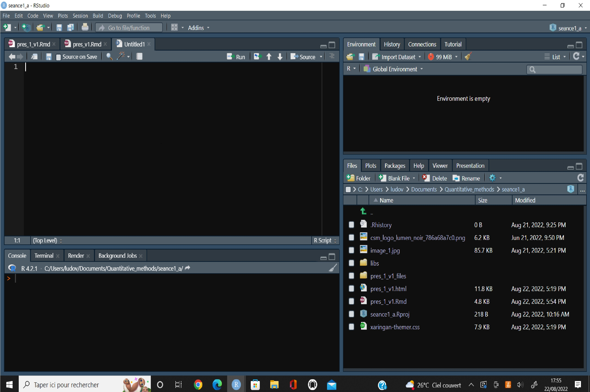

```{r setup, include=FALSE}
knitr::opts_chunk$set(echo = TRUE)
```


```{r xaringan-extra,echo=FALSE}
xaringanExtra::use_tile_view()
xaringanExtra::use_logo(
  image_url = "csm_logo_lumen_noir_786a68a7c0.png",
  width = "120px",height = "156px")
xaringanExtra::use_banner(
  bottom_left = "Working Environnement and data base - LV",
  exclude =c("inverse"))
xaringanExtra::use_progress_bar(color = "#1c5253",
                                location = "bottom",
                                height = "5px")
xaringanExtra::use_tachyons()
xaringanExtra::use_scribble()
xaringanExtra::use_share_again()
```


```{r xaringan-themer, include=FALSE, warning=FALSE}
library(xaringanthemer)
style_mono_accent(
  base_color = "#1c5253",
  header_font_google = google_font("Questrial"),
  text_font_google   = google_font("Mitr", "300", "300i"),
  code_font_google   = google_font("Fira Mono"),
  colors = c( red = "#f34213",
              purple = "#3e2f5b",
              orange = "#ff8811",
              green = "#136f63",
              white = "#FFFFFF",
              blue_ = "#1c5253")
)
```

```{r,echo=FALSE}
library(DT)
```


# Morning program

<hr/> 

--

1. Intalling Softwares 

--

2. R langage basis

--

3. WRDS data base

--

4. Extracting/importing data 


---

class: center,middle,inverse

# Intalling Softwares 

---

class: middle

## R langage

R is a programing langage dedicated to statistics and data sciences. 

* **easy to use** (simple synthax especially using the tidyverse)

* **free** (that makes a huge difference with Stat, SAS, Eview, SPSS...) and multi-platform (windows, OS, Linux)

* **evolutive**  (a very important community develop applications -free packages- and makes 'R base' evolve on a regular basis)

* **a lot of information available** ([R journal](https://journal.r-project.org/), [R bigbook](https://www.bigbookofr.com/finance.html), [R-BLOGGERS](https://www.r-bloggers.com/), [Stack overflow](https://stackoverflow.com/), [freakonometrics](https://freakonometrics.hypotheses.org/), [MyEconTricks](https://myecontricks.netlify.app/)...)

---

class: middle

## R langage

You can download R at the following adress https://www.r-project.org/ .

---

class: middle

## R Studio IDE

* What is a *IDE* ? 

It is just a *Interactif Developpement Environment*, a software that helps to deal with application creation using one or more programing language. 

R Studio is dedicated to data analysis. It provides tools to get data, to shape data (data wrangling), to draw graphs, to do statistics (test, regression models, other modeling...) and to produce reports (presentations, text documents, interactive product...).

Actualy, R studio is becoming posit. It will give more space to other programing langage (like Pyhton, Julia,C++...).

---

class: middle

## R Studio IDE

You can download R Studio at the following adress https://www.rstudio.com/products/rstudio/download/ .

---

class: middle

## Video installation guide

To help you to install R and R Studio IDE, I invite you to watch the follow trought video (duration about 5 minutes) here after.

https://youtu.be/hT2tSvj7d1A

---

class: middle

## Presentation of the R Studio environement

You will find a short presentation of the R Studio in the following video (duration about 15 minutes).

https://youtu.be/fB5QlyjWqK0

---

class: middle

## Presentation of the R Studio environement





---

class: middle

## Presentation of the R Studio environement

Four panel layouts

* **Source** : where you write your program and save it to make your analysis reproductible.

* **Console** : where you interact with R.

* **Environment** : where you find the different objects that you have created during your session. 

* **Files**, **Plots**, **Packages**, **Help**, **Viewer**, **Presentation** : you find the files in your working directory, you can view the graph made, the list of your installed packages, some descriptions of fonctions for which you have asked for help...

---

class: middle

## Presentation of the R Studio environement

It is important to create a new project when you start a data analysis.

*file -> new project* 

Indicate where to put the directory associated with your project and name it.

If you have some doubt on your actual working directory type **getwd()** in the console space.

In order to make your work reproductible, you must at least use a script file.

*file -> new file*

*Warning* : it is not because you have saved your project (.Rproj) that your data and your programs (.R,.Rmd...) are also saved (.csv,.xlSx...). **You have to save them independly!!**

---

class: center,middle,inverse

# R langage basis

---

class: middle

## The operators

* math : +, -, *,  /, %/%, 
         %*%, t(), ^, log(), exp()...

* assignation : <- = ->

* logical: < > <= >= == != %in%

---

class: middle

## The data types

* Character

* numeric :

 _ logical (0 FALSE 1 TRUE)
 
 _ factor 
 
 _ integer
 
 _ double
 
 _ etc...
 
---

class: middle

## The data objects

* vector

* matrix

* array

* list

* data frame 

---

class: middle

## The functions

There are commands that transform or produce new elements from a R object or a part of a R object.

--

There are shaped as follow : **name_of_the_function(main arguments, options)**

--

sum(x,na.rm==TRUE) make the sum of the element of vector named x. The option na.rm==TRUE excludes from the sum the NA values.

--

```{r}
x<-c(1:6,NA,c(5:9)-2)
x
sum(x)
sum(x,na.rm=TRUE)
```

---

class: middle

## Find some help about a function

Use the help window or just put ? in front the function name.

```{r}
?t.test()
```


---

class: middle

## The syntax

R base has a stacked syntax.


```{r}
paste(mean(x[x<5],na.rm=TRUE),'on average')
```

---

class: middle

## The syntax

R base has a stacked syntax.

```{r}
x
x<5
x[x<5]
mean(x[x<5],na.rm=TRUE)
paste(mean(x[x<5],na.rm=TRUE),'on average')
```

---

class: middle

## Intall and use packages

With R you have access to a wide panel of functions developped by the community. You can download packages of new functions from online repositories (like the CRAN, or github...).

Let's download the tidyverse package which includes a lot of usefull complementary fonctionality.

```{r eval=FALSE}
install.packages("tidyverse")
```

---

class: middle

## Intall and use packages

Once a package downloaded, you have to call it in your environment in order to use the included functions.

```{r}
library(tidyverse)
```

---

class: middle

## Intall and use packages

The tidyverse provides (among many other things) a usefull programing operator the simplify R syntax : the pipe operator %>% (keyboard shortcut 'ctrl' 'shift' 'm').


```{r}
x<-1:5
y<-8:4
data.frame(x,y) %>% summarise(m_x=mean(x),m_y=mean(y))
```

---

class: middle

## Intall and use packages

It is simpler than :

```{r}
lapply(data.frame(x,y), mean)
```
--

```{r}
sapply(data.frame(x,y), mean)
```

--

```{r}
apply(data.frame(x,y),2, mean)
```

---

class: middle


## The home made functions

You can create you own function using the following syntax.

**function_name<-function(arguements,...){**

**one program that do the job!!**

**}**

---

class: middle

## The home made functions

Let's build a function that compute the actual value of a given amount of money in *n* compounding periods when the opportinity interest rate is *i*.

---

class: middle

## The home made functions

Let's do the math.

--

$$Vf=VA\times{(1+i)^{n}}$$

--

$$VA=\frac{VF}{(1+i)^{n}}$$
---

class: middle

## The home made functions

Let's do the program.

--
```{r}
val_act<-function(vf,i,d){
  va<-vf*(1/(1+i)^d)
  return(va)
}
```

--

Let's test it.

--

```{r}
val_act(1159.2741,0.03,5)
```

---

class: middle

## The home made functions

Create a function that computes the annual interest rate allowing to obtain the final value from the initial one in n periods. (5 minutes)


---

class: middle

## The home made functions

Let's do the math.

--

$$Vf=VA\times{(1+i)^{n}}$$
--
$$\frac{Vf}{VA}=(1+i)^{n}$$
--
$$\left(\frac{Vf}{VA}\right)^{1/n}=1+i$$
--
$$i=\left(\frac{Vf}{VA}\right)^{1/n}-1$$
---

class: middle

## The home made functions

Let's do the programing.

--

```{r}
interet<-function(vf,va,n){
  i<-(vf/va)^(1/n)-1
  return(i)
}
```

--

Let's test it.

--

```{r}
interet(1159.2741,1000,5)
```

---

class: middle

## More on R langage

You can watch (later) a 40 minutes video that presentes more extensively the points that we have just review. You can find it at the followning adress:

https://youtu.be/hGffaVR4Dtk

---

class: middle,center

*short break*


---

class: center,middle,inverse

#  WRDS data base

---

class: middle

## Access to WRDS

You start from your Student ENT. You select "toutes les applications" and on the part dedicated to 'Bibliothèque' you click on 'Ressources électronques'.

ent -> toutes les applications -> Bibliothèque -> ressources électroniques

Once the 'ressources électroniques' page opens go to 'Accueil' and section the 'gestion' discipline. You can find the link with WRDS at the bottom of the current page. 

Accueil -> gestion -> wrds

---

class: middle

## Access to WRDS

.center[

]

---

class: middle

## Access to WRDS

.center[

]

---

class: middle

## Access to WRDS

.center[

]

---

class: middle

## Access to WRDS

.center[

]

---

class: middle

## Access to WRDS

.center[

]

---

class: middle

## Access to WRDS

You only have access to ressources marked by the plain blue links.

If you spend to much time without doing anything, you will be disconnected.

Your access is can be activated using the email link during a day long.

---

class: middle

## What WRDS is? 

It is a data base aggregator provided by the Wharton school of business of the university of Pennsylvania.

It allows to access multiple ressources in one place using a central data extraction interface.

It also provides some data treatement services (compute event studies, efficient portfolio, Beta...).

---

class: middle

## What the main ressources available are ?


* Compustat : accounting data about listed firms

* CRPS : share prices

* Thomson/Refinitiv (WRDS-Reuter Dealscan) : syndicated loan deals

* Trace : bonds

etc...

---

class: middle

## What the main ressources available are ?

Each database has it own indivuals' (company or security or CEO...) identifier. 

One of the first difficulties that you will have to deal with using those data base will be to manage those identifiers in order to merge the data accuratly. 

WRDS helps providing tables with merging keys (most of times).

---

class: center,middle,inverse

# Extracting/importing data


---

class: middle

## Extracting data from CRSP

The Center for Research in Security Prices, LLC (CRSP) maintains the most comprehensive collection of security price, return, and volume data for the NYSE, AMEX and NASDAQ stock markets. 

It is the gold standard data base on stocks in empirical finance (in US).

Most of the more important research papers published in top scientific journals (JF,JFE,JFQA...) have been produced using CRSP.


---

class: middle

## Extracting data from CRSP

.center[

]

---

class: middle

## Extracting data from CRSP

.center[

]


---

class: middle

## Extracting data from CRSP

.center[

]

---

class: middle

## Extracting data from CRSP

.center[

]


---

class: middle

## Extracting data from CRSP

.center[

]

---

class: middle

## Extracting data from CRSP

.center[

]

---

class: middle

## Extracting data from CRSP


Mission 1: 

Find the ticker of a stock of your choice and put it in the chat window (company name followed by the corresponding actual ticker).

---

class: middle

## Extracting data from CRSP


Let's take Google. 

A quick research on it provides us its ticker.


---

class: middle

## Extracting data from CRSP

.center[

]

---

class: middle

## Extracting data from CRSP

.center[

]


---

class: middle

## Extracting data from CRSP

.center[

]

---

class: middle

## Extracting data from CRSP

.center[

]

---

class: middle

## Extracting data from CRSP

.center[

]


---

class: middle

## Extracting data from CRSP

.center[

]

---

class: middle

## Extracting data from CRSP

.center[

]

---

class: middle

## Extracting data from CRSP

Copy the downloaded file in your working directory. 

Once done import your data in R.


```{r}
google <- read_csv("google.csv")
```


---

class: middle

## Extracting data from CRSP

let's see what do we have. head(google)

```{r, echo=FALSE}
datatable(head(google, 6),
  fillContainer = FALSE, options = list(pageLength = 6,scrollX = TRUE))
```


---

class: middle

## Extracting data from CRSP


```{r}
unique(google$PERMNO)
unique(google$PERMCO)
unique(google$TICKER)
unique(google$CUSIP)
unique(google$COMNAM)
```

---

class: middle

## Extracting data from CRSP

PERMNO (sercurity) and PERMCO (company) are unique identifier given once by crsp respectivily to a security and a company they never change and are never reaffected.

There is no survivor biais in CRSP.

---

class: middle

## Extracting data from CRSP

Put the date variable on a date format.

```{r}
str(google$date)
```


---

class: middle


## Extracting data from CRSP

You have to install the lubridate package to manage easily date format variables.

```{r, eval=FALSE}
install.packages(lubridate)
```

Once the new package installed, call it in your working environment.

```{r}
library(lubridate)
```

---

class: middle


## Extracting data from CRSP

So you can use ymd() function to format the date variable.

```{r}
google$date<-ymd(google$date)
```


```{r}
str(google$date)
```


---

class: middle


## Extracting data from CRSP


let's see what do we have now. head(google)

```{r, echo=FALSE}
datatable(head(google, 6),
  fillContainer = FALSE, options = list(pageLength = 6,scrollX = TRUE))
```


---

class: middle

## Extracting data from CRSP

Let's check if we have duplicated observations.

```{r}
google<-google %>% arrange(PERMNO,date) %>% 
  group_by(PERMNO,date) %>% 
  mutate(dup=n()) %>% ungroup()
table(google$dup)
```

---

class: middle

## Extracting data from CRSP

There is no duplicated observations. We can drop the dup variable.

```{r}
google <- google %>% select(-dup)
```


---

class: middle

## Extracting data from CRSP

There is too much information in the actual data base. Let reduce it to the ones we need.

```{r}
google<-google %>% select(PERMNO,COMNAM,date,PRC,RET,RETX,DIVAMT,DISTCD,
                          DCLRDT,RCRDDT,PAYDT)
```


---

class: middle

## Extracting data from CRSP

When did google start to be listed?

--

```{r}
min(google$date)
```

Created in september 1998.

--

Did Google (Alphabet) pay some dividends since its listing? 

--

```{r}
unique(google$DIVAMT)
```

---

class: middle

## Extracting data from CRSP

No dividence, we can also drop the related information.

```{r}
google<-google %>% select(PERMNO,COMNAM,date,PRC,RET,RETX)
```

---

class: middle

## Extracting data from CRSP

Let's check if RET and RETX are always equal.

--

```{r}
sum(google$RET==google$RETX)
```

We can drop RETX.

```{r}
google<-google %>% select(-RETX)
```

---

class: middle

## Extracting data from CRSP

How are returns established in CRSP?

--

Simple return

$$r_{t} = \frac{P_{1}-P_{0}}{P_{0}}=\frac{P_{1}}{P_{0}}-1$$

--

```{r}
google$PRC[2]/google$PRC[1]-1
google$RET[2]
```

CRPS provides simple retrurns.

---

class: middle

## Extracting data from CRSP

Returns (RET) are in character format. Lets transform the variable to make it  numeric.

```{r}
google$RET[1:10]
google$RET<-as.numeric(google$RET)
google$RET[1:10]
```

---

class: middle

## Extracting data from CRSP

Let compute our own simple returns for the entier data base and compare with the precomputed returns

```{r}
google <- google %>% arrange(date) %>% 
  mutate(ret_s=round(PRC/lag(PRC)-1,digits=6),
         test=RET==ret_s)
google
```


---

class: middle

## Extracting data from CRSP

Let see if the two variables always match.

--

```{r}
sum(google$test,na.rm=TRUE)
```

It is not the case. 

--

```{r}
google %>% filter(test==FALSE)
```

It is just marginal rounding problems.

---

class: middle

## Extracting data from CRSP

Let consider the continuous returns starting with some math.

$$vf=va.e^{r.n}$$
$$\frac{vf}{va}=e^{r.n}$$

$$ln\left(\frac{vf}{va}\right)=ln(e^{r.n})$$

$$r.n=ln\left(\frac{vf}{va}\right)$$

$$r=\frac{1}{n}.ln\left(\frac{vf}{va}\right)$$

here we just consider one period (so n=1).

$$r_{t} = \ln(\frac{P_{1}}{P_{0}})$$

---

class: middle

## Extracting data from CRSP

Let compute the continuous daily returns for Google.

```{r}
google<-google %>% mutate(ret_c=log(PRC/lag(PRC)))
```

---

class: middle

## Extracting data from CRSP

Let compute the final value after one period using continuous returns.

--

```{r}
google$PRC[1]*exp(google$ret_c[2])
```

---

class: middle

## Extracting data from CRSP

Let consider now multiperiods returns.

Compute the return between date 1 **[2004-08-19]** and date 4 **[2004-08-24]**.

```{r}
google$PRC[1]
google$PRC[4]
```

---

class: middle

## Extracting data from CRSP

Let consider now multiperiods returns.

--

simple return

```{r}
google$PRC[4]/google$PRC[1]-1
google$PRC[1]*(1+(google$PRC[4]/google$PRC[1]-1))
```

--

continuous returns

```{r}
log(google$PRC[4]/google$PRC[1])
google$PRC[1]*exp(log(google$PRC[4]/google$PRC[1]))
```

---

class: middle

## Extracting data from CRSP

simple returns intra period

```{r}
google$PRC[1]*(1+google$ret_s[2])*(1+google$ret_s[3])*(1+google$ret_s[4])
```

using cumprod()

```{r}
google$PRC[1]*cumprod(1+google$ret_s[2:4])[3]
```

---

class: middle

## Extracting data from CRSP

simple returns intra period

using geometric average

```{r}
google$PRC[1]*(prod(1+google$ret_s[2:4])^(1/3))^3
```

using a home made function for geometric average.

--

```{r}
geomet_moy<-function(x){
  y<-prod(1+x)^(1/length(x))
  return(y)
}
```

```{r}
google$PRC[1]*geomet_moy(google$ret_s[2:4])^3
```

---

class: middle

## Extracting data from CRSP

continuous returns intra period

```{r}
google$PRC[1]*exp(sum(google$ret_c[2:4]))
```
```{r}
google$PRC[1]*exp(mean(google$ret_c[2:4])*3)
```

---

class: middle

## Extracting data from CRSP

Are Google return normaly distributed?


---

class: middle

## Extracting data from CRSP

Let see it drawing a histogram.

---

class: middle, center

```{r,fig.show='hide'}
hist(google$ret_c,nclass = 100,
     main="histogram of google stock return",xlab='return')
abline(v=mean(google$ret_c,na.rm=TRUE),col='red')
```

---

class: middle, center

```{r, echo=FALSE}
hist(google$ret_c,nclass = 100,
     main="histogram of google stock return",xlab='return')
abline(v=mean(google$ret_c,na.rm=TRUE),col='red')
```

---

class: middle

## Extracting data from CRSP

To be sure, let perform a Shapiro-Wilk test.

```{r}
shapiro.test(google$ret_c)
```

---

class: middle

## Extracting data from CRSP

We also can examine the normality with a quantile-quantile plot (QQplot).

---

class: middle,center

```{r, fig.show='hide'}
qqnorm(google$ret_c)
qqline(google$ret_c,col='red')
```

---

class: middle,center

```{r, echo=FALSE}
qqnorm(google$ret_c)
qqline(google$ret_c,col='red')
```

---

class: middle

## Extracting data from CRSP

Let drop the more extrem observation.

---

class: middle

```{r,fig.show='hide'}
hist(google$ret_c[which(google$ret_c>-0.68)],nclass = 100,
     main="histogram of google stock return",xlab='return')
abline(v=mean(google$ret_c[which(google$ret_c>-0.68)],
              na.rm=TRUE),col='red')
```

---

class: middle

```{r,echo=FALSE}
hist(google$ret_c[which(google$ret_c>-0.68)],nclass = 100,
     main="histogram of google stock return",xlab='return')
abline(v=mean(google$ret_c[which(google$ret_c>-0.68)],
              na.rm=TRUE),col='red')
```


---

class: middle

## Extracting data from CRSP


```{r}
shapiro.test(google$ret_c[which(google$ret_c>-0.68)])
```

---

class: middle

## Extracting data from CRSP

```{r,fig.show='hide'}
qqnorm(google$ret_c[which(google$ret_c>-0.68)])
qqline(google$ret_c[which(google$ret_c>-0.68)],col='red')
```

---

class: middle

## Extracting data from CRSP

```{r,echo=FALSE}
qqnorm(google$ret_c[which(google$ret_c>-0.68)])
qqline(google$ret_c[which(google$ret_c>-0.68)],col='red')
```

---

class: middle

## Extracting data from CRSP

Let estimate the CAPM Beta of Google.

What do we need?

--


* stock return

* market return

* risk free rate

--

$$E(r_{it})=\alpha_i+\beta_i(rm_{t}-rf_{t})+\epsilon_{i,t}$$

---

class: middle

## Extracting data from CRSP (market index)


---

class: middle

## Extracting data from CRSP (market index)


```{r}
index_CRPS <- read_csv("index_CRPS.csv")
```


---

class: middle

## Extracting data from CRSP (market index)

Import data in R

```{r}
index_CRPS$DATE<-ymd(index_CRPS$DATE)
```

---

class: middle

## Extracting data from CRSP (market index)

format data.

```{r}
index_CRPS_<-index_CRPS %>% select(DATE,vwretd) %>% 
  filter(DATE>="2004-08-19") %>% 
  rename(date=DATE)
```


---

class: middle

## Extracting data from CRSP (market index)

merge the data with google returns.

```{r}
mer_base<-left_join(google,index_CRPS_)
```

drop omit values (NA)

```{r}
mer_base<-mer_base %>% na.omit()
```


---

class: middle

## Extracting data from Fama-French Portofolio and factors (risk free rate)


---

class: middle

## Extracting data from Fama-French Portofolio and factors (risk free rate)


---

class: middle

## Extracting data from Fama-French Portofolio and factors (risk free rate)

Now, we can import the new data in R 

```{r}
risk_free_rate <- read_csv("risk_free_rate.csv")
```


---

class: middle

## Extracting data from Fama-French Portofolio and factors (risk free rate)

and prepare them to be merged with our estimation sample data.

```{r}
risk_free_rate <- risk_free_rate %>% select(date,rf) %>% 
  mutate(date=ymd(date)) %>% 
  filter(date>="2004-08-19"&date<='2022-03-31')
```

---

class: middle

## Extracting data from Fama-French Portofolio and factors (risk free rate)

Merge the data

```{r}
mer_base<-left_join(mer_base,risk_free_rate)
```

---

class: middle

## Estimating MEDAF BETA

Variables computation

* risk premium

* market risk premium


---

class: middle

## Estimating MEDAF BETA


```{r}
mer_base<-mer_base %>% mutate(risp=RET-rf,
                              markrisp=vwretd-rf)
```


---

class: middle

## Estimating MEDAF BETA

Let limit us to a estimation over 130 cotation days.

```{r}
rega<-lm(risp~markrisp,data=filter(mer_base,date<=date[130]))
summary(rega)
```

---

class: middle

If you want more about importing and managing data with R, you can watch the following video https://youtu.be/1CSE0mQVwAQ (31 minutes).


---

class: middle


